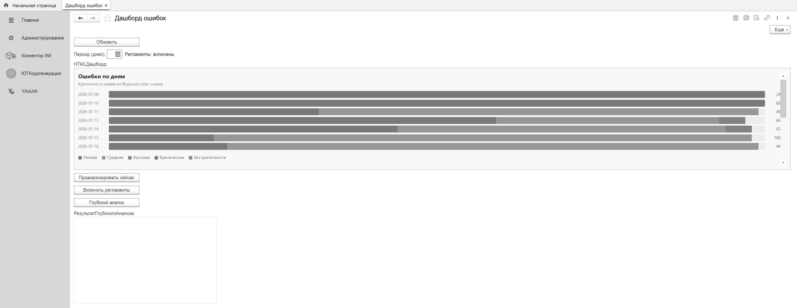
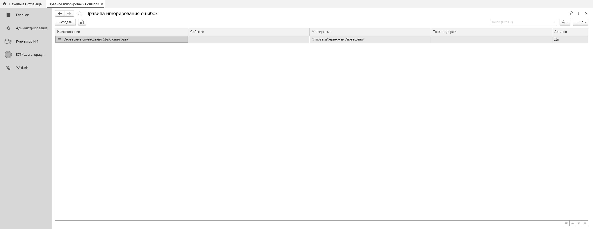

# Анализ ошибок

Подсистема отслеживает ошибки 1С, складывает их в журнал и на дашборд, а при включённом
аудиторе кода — автоматически ставит диагноз по месту падения через LLM.

## Разделы

- **[Аудитор кода](аудитор-кода.md)** — по координате из стека (`Модуль.Метод(Строка)`) находит
  упавший метод и его граф вызовов, ставит диагноз через коннектор ИИ и пишет результат в журнал.
- **Дашборд и журнал ошибок** — сводка ошибок по дням с разбивкой по критичности и список
  уникальных ошибок с результатами анализа — _(страница в работе)_
- **Правила игнорирования** — подавление шумных ошибок: правило задаёт подстроки по событию,
  метаданным и тексту; совпавшая ошибка помечается «Игнорировать» ещё на сборе и не идёт
  ни в анализ, ни в уведомления.

## Как это связано

Ошибка → журнал мониторинга → аудитор читает координату из стека → внешний движок (шим + rlm)
отдаёт метод и граф вызовов → диагноз ставит LLM через коннектор → результат пишется обратно в
журнал (`ОписаниеОтИИ`). На внешнем движке ничего ценного не оседает.
