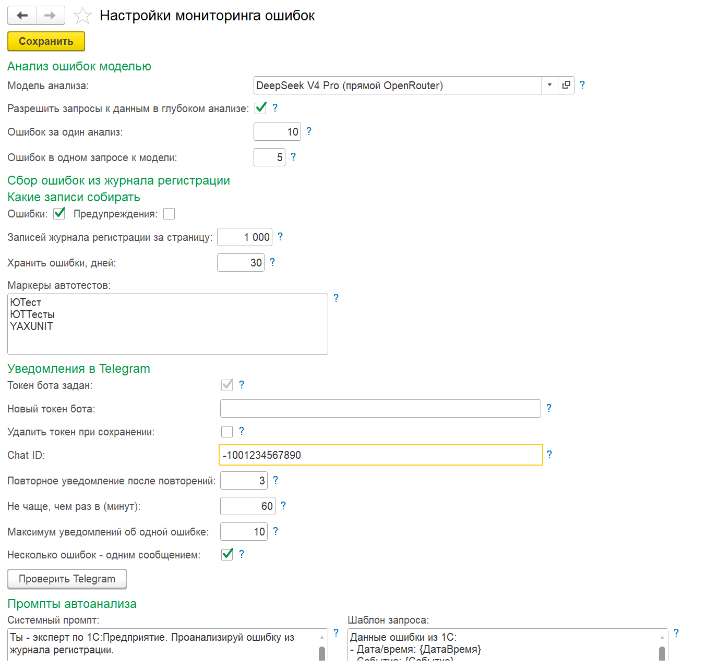
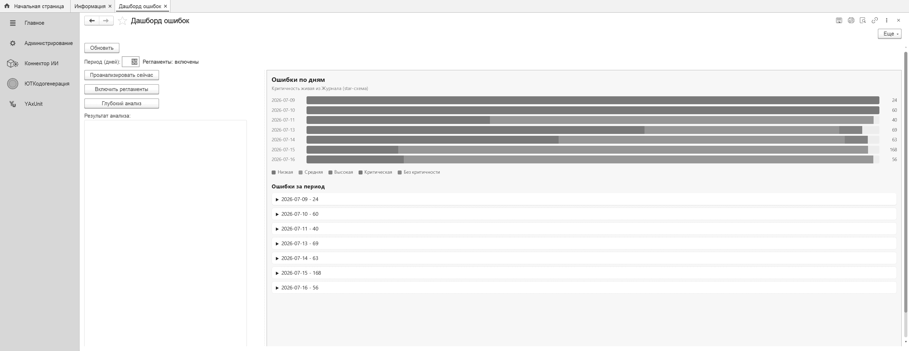
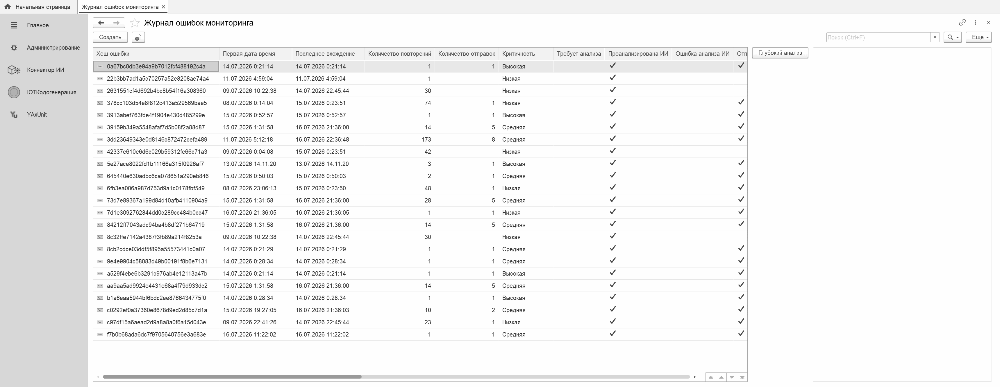
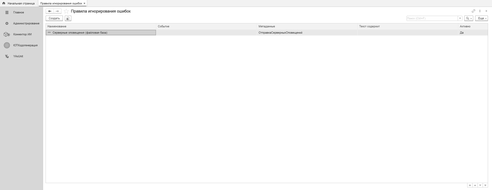

# Анализ ошибок

Мониторинг собирает ошибки из журнала регистрации, схлопывает повторы, отдает новые ошибки
модели на разбор и присылает итог в Telegram. Все видно на дашборде и в журнале ошибок.

```
Журнал регистрации ─▶ сбор (раз в час) ─▶ журнал ошибок ─▶ анализ моделью (раз в час) ─▶ Telegram
                                              │
                                              └─▶ дашборд, глубокий анализ, аудитор кода
```

## Включить за три шага

1. **Настройки.** «Коннектор ИИ» → «Настройки мониторинга ошибок»: выберите модель анализа и,
   если нужны уведомления, токен бота и Chat ID Telegram. «Сохранить».
2. **Регламенты.** Откройте «Дашборд ошибок» и нажмите «Включить регламенты». Регламентные
   задания расширения не бывают предопределенными, поэтому их создает эта кнопка: сбор ошибок
   и анализ — раз в час, очистка — раз в сутки.
3. **Проверка Telegram.** В настройках нажмите «Проверить Telegram» — в чат придет тестовое
   сообщение.

Нужна роль «КИИ полные права»; права администратора не нужны.

## Настройки мониторинга

С версии 1.6.1 все настройки — на одной форме. Раньше они правились только константами через
«Все функции».



**Анализ ошибок моделью**

| Поле | Что задает |
|---|---|
| Модель анализа | модель для автоанализа, глубокого анализа и [аудитора кода](аудитор-кода.md) |
| Разрешить запросы к данным в глубоком анализе | глубокий анализ сможет читать данные базы запросами; выключено — модель видит только метаданные (см. [агентская петля](../агентская-петля/README.md#инструменты)) |
| Ошибок за один анализ | сколько новых ошибок разбирает один запуск; остальные ждут следующего |
| Ошибок в одном запросе к модели | сколько ошибок уходит модели одним запросом |

**Сбор ошибок из журнала регистрации**

| Поле | Что задает |
|---|---|
| Какие записи собирать | ошибки и (или) предупреждения журнала регистрации |
| Записей журнала регистрации за страницу | сколько записей читается за раз; за один сбор — не больше 100 страниц, остаток дочитает следующий |
| Хранить ошибки, дней | регламентная очистка удаляет старше срока журнал ошибок, статистику и [журнал запросов ИИ](../журнал-запросов/README.md) |
| Маркеры автотестов | подстроки, по одной в строке: запись со стеком, где встречается маркер, считается автотестом и в мониторинг не попадает |

**Уведомления в Telegram**

| Поле | Что задает |
|---|---|
| Токен бота задан | токен хранится в безопасном хранилище и на форму не выводится |
| Новый токен бота | ввести, чтобы заменить; пусто — токен не меняется |
| Удалить токен при сохранении | уведомления перестанут уходить |
| Chat ID | кому отправлять: пользователь, группа или канал |
| Повторное уведомление после повторений | повтор уже отправленной ошибки уходит, только если она повторилась не меньше стольких раз |
| Не чаще, чем раз в (минут) | интервал между повторными уведомлениями об одной ошибке |
| Максимум уведомлений об одной ошибке | после стольких уведомлений повторы не уходят; 0 — без ограничения |
| Несколько ошибок — одним сообщением | если анализ нашел несколько ошибок, приходит одна сводка |

**Промпты разбора по одной ошибке** — системная инструкция и шаблон запроса. В шаблоне
работают подстановки `{ДатаВремя}`, `{Событие}`, `{Пользователь}`, `{Компьютер}`,
`{Метаданные}`, `{ТекстОшибки}`. Они действуют, когда ошибка разбирается по одной: в пакете
одна ошибка, «Ошибок в одном запросе к модели» равно 1 или пакетный ответ модели не удалось
разобрать. Пакет из нескольких ошибок разбирается встроенным пакетным промптом — чтобы все
ошибки шли через ваши промпты, поставьте «Ошибок в одном запросе к модели» = 1.

## Что происходит с ошибкой

1. **Сбор.** Регламент читает журнал регистрации с момента прошлого сбора. Одинаковые ошибки
   схлопываются в одну запись по событию и тексту — в журнале ошибок растет счетчик
   повторений. Ошибки, подходящие под правило игнорирования, помечаются «Игнорировать» и
   дальше не идут.
2. **Анализ.** Регламент отдает новые ошибки модели пачками и записывает разбор — критичность
   и описание — в журнал ошибок. Без модели анализа этот шаг пропускается.
3. **Уведомление.** Разобранные ошибки уходят в Telegram — по одной или сводкой. Повторы уже
   отправленной ошибки уходят по порогу и интервалу из настроек.

## Дашборд ошибок

«Коннектор ИИ» → «Дашборд ошибок»: ошибки по дням с разбивкой по критичности, самые частые
ошибки, токены и расходы ИИ по дням.



| Кнопка | Что делает |
|---|---|
| Обновить | перечитывает данные |
| Проанализировать сейчас | запускает анализ моделью, не дожидаясь регламента; сбор при этом не запускается |
| Включить регламенты | создает и включает регламенты сбора, анализа и очистки |
| Глубокий анализ | разбирает самую частую ошибку [агентской петлей](../агентская-петля/README.md) |

**Веб-дашборд.** Тот же дашборд открывается в браузере без клиента 1С:
`http://<сервер>/<база>/hs/iikona-dashboard/page`. Нужна публикация HTTP-сервисов базы на
веб-сервере и роль «Просмотр дашборда ошибок» у пользователя.

## Журнал и статистика ошибок

«Журнал ошибок мониторинга» — одна строка на уникальную ошибку: событие, текст, первое и
последнее вхождение, число повторений, критичность, разбор модели, признаки «Отправлена в
Телеграм» и «Игнорировать».



Выделите ошибку и нажмите «Глубокий анализ»: модель с инструментами посмотрит структуру
объектов из текста ошибки и, если разрешено, данные. Диагноз встает первой секцией поля
«Описание от ИИ», прежний автоанализ остается ниже. Повторный глубокий анализ заменяет свою
секцию.

«Статистика ошибок» — сколько раз ошибка случилась по дням; из нее строятся графики дашборда.
Там тоже есть «Глубокий анализ».

## Правила игнорирования

«Коннектор ИИ» → «Правила игнорирования ошибок». Правило задает подстроки по событию,
метаданным и тексту ошибки; флажок «Активно» включает его. Совпавшая ошибка помечается
«Игнорировать» еще на сборе и не идет ни в анализ, ни в уведомления.



## Персональные данные

Текст ошибки, имя пользователя и разбор модели перед отправкой в Telegram проходят
[контроль персональных данных](../контроль-персональных-данных/README.md): по умолчанию ФИО,
ИНН, телефоны и почта заменяются подстановками. Разбор модели в журнале ошибок тоже хранится с
подстановками — модель их и видела.

## Аудитор кода

[Аудитор кода](аудитор-кода.md) по координате из стека (`Модуль.Метод(Строка)`) находит
упавший метод и его граф вызовов через внешний движок, ставит диагноз моделью анализа и пишет
результат в журнал ошибок. На внешнем движке ничего не оседает.

## Если не работает

| Что видно | Что проверить |
|---|---|
| Журнал ошибок пуст | нажата ли «Включить регламенты»; есть ли в журнале регистрации записи выбранных уровней |
| Ошибки есть, разбора нет | выбрана ли модель анализа; журнал запросов ИИ — нет ли ошибок модели |
| Не приходит в Telegram | «Проверить Telegram»; добавлен ли бот в чат; не отклоняет ли отправку [контроль ПД](../контроль-персональных-данных/README.md) в режиме «Не отправлять» |
| «Модель анализа не поддерживает инструменты» | у модели нет флажка «Поддерживает инструменты» — глубокому анализу он нужен |
| Прогон автотестов приходит в Telegram | тестовые ошибки без стека маркер не ловит; гоняйте тесты на базе, где мониторинг и уведомления выключены |
