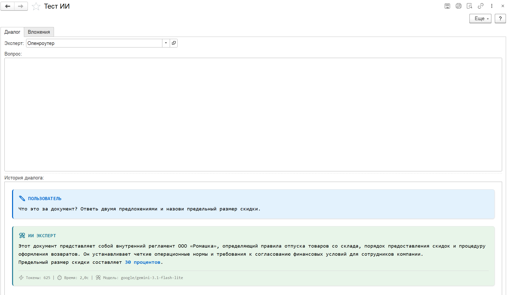

# Вложения и картинки

В «Тесте ИИ» к вопросу можно приложить картинки и документы, а модель генерации изображений
возвращает картинку прямо в диалог.

## Приложить файл к вопросу

1. На вкладке «Диалог» нажмите «Прикрепить файлы» и выберите один или несколько файлов.
2. Файлы появятся на вкладке «Вложения» с отмеченным флажком «Отправлять». Снимите флажок,
   чтобы оставить файл в списке, но не отправлять.
3. Задайте вопрос и нажмите «Отправить».

Файл уходит с одним вопросом: после ответа флажки «Отправлять» снимаются. Чтобы спросить про
тот же файл еще раз, отметьте его снова — или просто задайте уточняющий вопрос: предыдущий
ответ модели уйдет в истории диалога. «Очистить вложения» убирает все файлы из списка. Список
живет, пока открыта форма.

| Файл | Как уходит модели |
|---|---|
| PNG, JPG, JPEG, WEBP, GIF | картинкой |
| PDF, DOC, DOCX, RTF | документом, как есть |
| CSV, JSON, XML, HTML и файлы с другим расширением (TXT, MD, LOG) | текстом: ИИкона читает файл в UTF-8 и вставляет в вопрос с пометкой «Содержимое файла …» |

## Какие модели принимают файлы

Картинки и документы принимают форматы API OpenAI-совместимый, Anthropic, Google Gemini и
GigaChat. Формат Yandex вложения не принимает: «Тест ИИ» предупредит до отправки, что
провайдер не поддерживает мультимодальный ввод.

Формат — это протокол, а не конкретная модель. Если модель провайдера не умеет картинки или
PDF, ИИкона запрос отправит, а ошибку вернет провайдер. Что принимает модель, смотрите в ее
описании у провайдера.

## Контроль персональных данных

[Контроль персональных данных](../контроль-персональных-данных/README.md) заменяет ФИО, ИНН и
телефоны в тексте вопроса, в текстовых файлах (их содержимое уходит текстом) и в именах
файлов. Содержимое картинок и документов (PDF, DOCX) он не читает. Если для запросов к
моделям выбран режим «Не отправлять», запрос с таким вложением не уходит совсем.

## Генерация картинок

Нужна модель с форматом API «OpenAI Генерация изображений» и эксперт на ней. Адрес запроса
определяет протокол:

| Адрес запроса | Протокол | Пример |
|---|---|---|
| `…/chat/completions` | чат с ответом-картинкой | OpenRouter: адрес `openrouter.ai`, адрес запроса `/api/v1/chat/completions`, модель `google/gemini-3.1-flash-image-preview` |
| `/v1/images/generations` | генерация изображений OpenAI | OpenAI: модели `gpt-image` |

Среди предустановленных моделей генераторов картинок нет: модель заводится вручную.

Картинка появляется в «Истории диалога», а на вкладке «Вложения» — строкой с направлением
«Сгенерировано». Кнопка «Просмотреть» открывает картинку, «Сохранить файл» сохраняет ее на
диск.

Модели генерации уходит только текст вопроса: промпт эксперта и история диалога ей не
передаются. Вложения к такой модели не отправляются — «Тест ИИ» остановит отправку с
сообщением «Неподдерживаемый формат API».

## Если не получилось

| Что видно | Что проверить |
|---|---|
| «Провайдер … не поддерживает мультимодальный ввод» | формат модели эксперта — Yandex; выберите эксперта на другом формате |
| Ошибка провайдера про изображение или файл | модель не принимает этот тип файла; возьмите мультимодальную модель |
| Запрос отклонен контролем персональных данных | режим «Не отправлять» и вложение в запросе, см. выше |
| «Не удалось извлечь изображение из ответа» | модель ответила текстом без картинки: проверьте имя модели генерации и адрес запроса |
