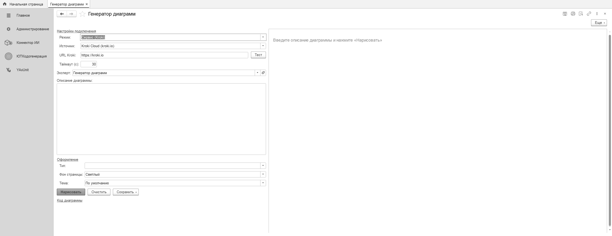

# Диаграммы

Генератор диаграмм строит схему по **текстовому описанию** (через языковую модель) или по
**готовому коду** диаграммы, а затем рендерит её в картинку. Поддерживаются Mermaid, PlantUML,
C4, GraphViz, BPMN и другие форматы — рендеринг идёт через сервис **Kroki**.

## Как это устроено

```
Описание ─▶ модель ИИ ─▶ код диаграммы ─┐
                                        ├─▶ Kroki ─▶ SVG/PNG ─▶ поле на форме
Готовый код ────────────────────────────┘   (при недоступности Kroki —
                                              резервный рендер Mermaid в браузере)
```

Два режима работы:

1. **По описанию** — вы пишете, что нужно изобразить, обычным текстом. Эксперт ИИ
   (см. ниже) превращает это в код диаграммы, который затем рендерится.
2. **По коду** — вы вставляете готовый код Mermaid/PlantUML/GraphViz, генератор его сразу
   рендерит. Тип диаграммы определяется автоматически по первым строкам кода.



## Что нужно

- Доступный сервис **Kroki** (self-hosted или публичный) — адрес задаётся на форме
  генератора либо в настройках.
- Для режима «по описанию» — настроенный `КИИ_КоннекторИИ` и эксперт ИИ на модели
  (см. **[Настройка моделей](../настройка-моделей/README.md)**).

## Поддерживаемые форматы

Генератор подсказывает модели ориентироваться на форматы, которые умеет отрисовать Kroki:

- **Mermaid** — блок-схемы (`graph TD`/`LR`), последовательности (`sequenceDiagram`), классы
  (`classDiagram`), состояния, ER-схемы (`erDiagram`), Gantt, круговые, git-граф.
- **PlantUML** — UML-диаграммы любого вида (компоненты, развёртывание, use-case).
- **C4 (PlantUML)** — архитектурные диаграммы в нотации C4.
- **GraphViz (DOT)** — произвольные графы, деревья зависимостей, сети.
- **BPMN** — бизнес-процессы (когда нотация запрошена явно).

Всего Kroki покрывает более двух десятков типов; при вводе готового кода можно использовать
любой из них.

## Эксперт ИИ для диаграмм

Режим «по описанию» работает через **эксперта ИИ** — элемент справочника «Эксперты ИИ» с
привязанной моделью и системным промптом. Промпт объясняет модели, какие форматы
использовать и как оформлять вывод (только код, без пояснений).

При первом запуске генератор может создать предзаполненного эксперта автоматически. Дальше
эксперт настраивается как обычно: можно сменить модель, поправить промпт.

**Работа с данными конфигурации.** Если у выбранной модели включён флаг «Поддерживает
инструменты», эксперт может строить диаграммы **по реальной структуре вашей конфигурации** —
он сам запрашивает состав объектов, структуру справочников и регистров, при необходимости
данные, и рисует схему с настоящими именами реквизитов, а не выдуманными. Для этого нужна
модель с поддержкой function-calling (см. настройку моделей). Модели без инструментов строят
диаграмму только по тексту описания.

## Рендеринг через Kroki

Код диаграммы отправляется в Kroki, который возвращает готовую картинку (SVG или PNG).
Адрес Kroki указывается на форме генератора; для локального использования удобно поднять
Kroki рядом с 1С.

Если Kroki недоступен, для Mermaid-диаграмм срабатывает **резервный рендер** — диаграмма
рисуется встроенной библиотекой прямо в поле формы (для остальных форматов резерва нет,
нужен Kroki).

Кириллица в подписях работает во всех форматах, включая Mermaid.

## Темы оформления

Для Mermaid можно выбрать тему (`default`, `dark`, `forest`, `neutral`) и цвет фона —
генератор добавит нужную директиву перед отправкой в Kroki.

## Условные обозначения

Плейсхолдеры — `<адрес-kroki>` — подставьте адрес своего сервиса Kroki.
