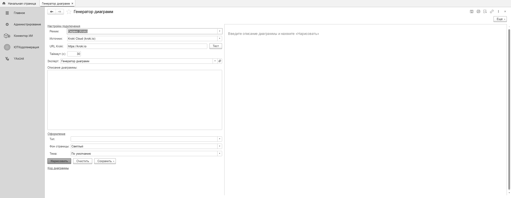

# Диаграммы

Генератор диаграмм строит схему по **текстовому описанию** (через языковую модель) или по
**готовому коду** диаграммы, а затем рендерит её в картинку. Поддерживаются Mermaid, PlantUML,
C4, GraphViz, BPMN и другие форматы — рендеринг идёт через сервис **Kroki**.

## Как это устроено

```
Описание ─▶ модель ИИ ─▶ код диаграммы ─┐
                                        ├─▶ Kroki ─▶ SVG/PNG ─▶ поле на форме
Готовый код ────────────────────────────┘   (при недоступности Kroki —
                                              резервный рендер Mermaid в браузере)
```

Два режима работы:

1. **По описанию** — вы пишете, что нужно изобразить, обычным текстом. Эксперт ИИ
   (см. ниже) превращает это в код диаграммы, который затем рендерится.
2. **По коду** — вы вставляете готовый код Mermaid/PlantUML/GraphViz, генератор его сразу
   рендерит. Тип диаграммы определяется автоматически по первым строкам кода.



## Что нужно

- Доступный сервис **Kroki** (self-hosted или публичный) — адрес задаётся на форме
  генератора либо в настройках.
- Для режима «по описанию» — настроенный `КИИ_КоннекторИИ` и эксперт ИИ на модели
  (см. **[Настройка моделей](../настройка-моделей/README.md)**).

## Поддерживаемые форматы

Генератор подсказывает модели ориентироваться на форматы, которые умеет отрисовать Kroki:

- **Mermaid** — блок-схемы (`graph TD`/`LR`), последовательности (`sequenceDiagram`), классы
  (`classDiagram`), состояния, ER-схемы (`erDiagram`), Gantt, круговые, git-граф.
- **PlantUML** — UML-диаграммы любого вида (компоненты, развёртывание, use-case).
- **C4 (PlantUML)** — архитектурные диаграммы в нотации C4.
- **GraphViz (DOT)** — произвольные графы, деревья зависимостей, сети.
- **BPMN** — бизнес-процессы (когда нотация запрошена явно).

Всего Kroki покрывает более двух десятков типов; при вводе готового кода можно использовать
любой из них.

## Эксперт ИИ для диаграмм

Режим «по описанию» работает через **эксперта ИИ** — элемент справочника «Эксперты ИИ» с
привязанной моделью и системным промптом. Промпт объясняет модели, какие форматы
использовать и как оформлять вывод (только код, без пояснений).

Пока эксперт не выбран, рядом с полем видна кнопка «Создать эксперта»: она создает эксперта
«Генератор диаграмм» с готовым промптом. Модель в нем пустая — выберите ее в карточке
эксперта. Дальше эксперт настраивается как обычно (см. [Эксперты ИИ](../эксперты/README.md)).

**Работа с данными конфигурации.** Если в описании прямо названы объекты конфигурации
(`Справочник.КИИ_МоделиИИ`, `РегистрСведений.КИИ_ЛогЗапросовИИ`), генератор сам кладет их
состав в промпт — модель рисует настоящие имена реквизитов, а не выдуманные.

Если у модели эксперта стоит флажок «Поддерживает инструменты», генерация идет через
**[агентскую петлю](../агентская-петля/README.md)**: модель сама запрашивает дерево
метаданных, структуру справочников и регистров, при необходимости данные — и находит нужные
объекты, даже когда в описании они названы своими словами. Так работает и форма (с версии
1.6.1), и программный вызов `СгенерироватьДиаграмму`. Модели без инструментов строят
диаграмму по тексту описания и составу явно названных объектов.

## Рендеринг через Kroki

Код диаграммы отправляется в Kroki, который возвращает готовую картинку (SVG или PNG).
Адрес Kroki указывается на форме генератора; для локального использования удобно поднять
Kroki рядом с 1С.

Если Kroki недоступен, для Mermaid-диаграмм срабатывает **резервный рендер** — диаграмма
рисуется встроенной библиотекой прямо в поле формы (для остальных форматов резерва нет,
нужен Kroki).

Кириллица в подписях работает во всех форматах, включая Mermaid.

Код диаграммы уходит на сервер Kroki, поэтому проходит
**[контроль персональных данных](../контроль-персональных-данных/README.md)**. По умолчанию для Kroki
режим «Только записывать в журнал»: код уходит как есть, находки пишутся в журнал. Если Kroki публичный, выберите
«Заменять подстановками» — подписи заменятся подстановками, а в SVG на форме вернутся исходные (в PNG
останутся подстановки). Для своего Kroki в контуре отметьте «Сервер Kroki свой» — проверка
выключится. Код, который модель сгенерировала по описанию, показывается на форме с исходными
значениями.

## Темы оформления

Для Mermaid можно выбрать тему (`default`, `dark`, `forest`, `neutral`) и цвет фона —
генератор добавит нужную директиву перед отправкой в Kroki.

## Условные обозначения

Плейсхолдеры — `<адрес-kroki>` — подставьте адрес своего сервиса Kroki.
