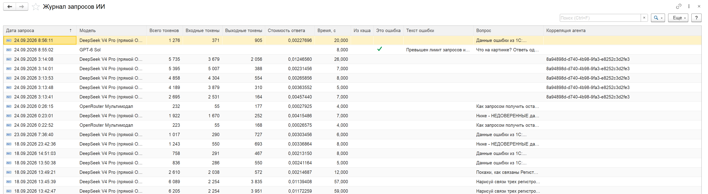
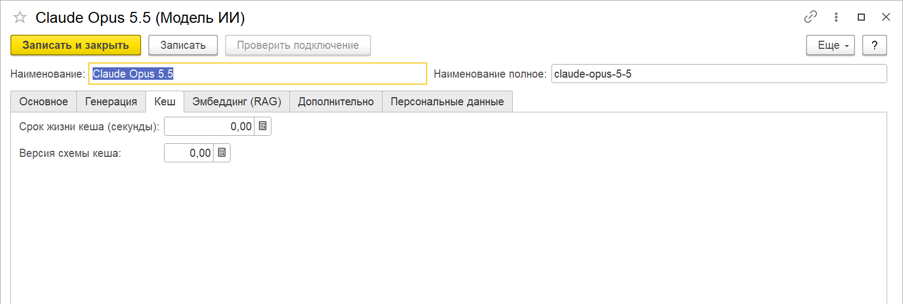

# Журнал запросов, расходы и кеш

Каждый запрос к модели ИИкона записывает в «Журнал запросов ИИ»: сколько токенов ушло,
сколько это стоило, сколько ждали ответа и была ли ошибка. Там же видно, какие ответы взяты
из кеша.

Журнал: «Коннектор ИИ» → «Журнал запросов ИИ».

## Что в журнале

| Колонка | Что значит |
|---|---|
| Дата запроса | когда запрос ушел |
| Модель | элемент «Модели ИИ», через который шел запрос |
| Всего / Входные / Выходные токены | по данным провайдера |
| Стоимость ответа | по данным провайдера, см. «Расходы» |
| Время, с | сколько ждали ответа |
| Из кеша | ответ взят из кеша ИИконы, провайдеру запрос не уходил |
| Это ошибка, Текст ошибки | провайдер вернул ошибку или запрос не дошел |
| Вопрос | текст вопроса; для вопроса с вложениями — текст и пометки о файлах |
| Корреляция агента | общий идентификатор раундов одной [агентской петли](../агентская-петля/README.md) |

Список открывается сначала свежими записями. Отбор по модели, периоду или ошибкам — через
«Еще» → «Настроить список». Двойной щелчок открывает запись целиком: на вкладке «Промпты» —
системный промпт, вопрос и история диалога, на вкладке «Ответы» — ответ модели и текст
ошибки.

В журнал попадают запросы «Теста ИИ», генератора диаграмм, анализа ошибок и все раунды
агентской петли. Запросы к модели-эмбеддеру для [RAG](../rag/README.md) не записываются.

Промпты и ответы хранятся в том виде, в каком ушли модели: если
[контроль персональных данных](../контроль-персональных-данных/README.md) заменил ФИО или ИНН,
в журнале останутся подстановки.

## Расходы

Стоимость в журнал записывается, только если провайдер сам возвращает ее в ответе. Так
делает OpenRouter: поле `usage.cost` приходит в каждом ответе, в долларах. OpenAI, Anthropic,
Google, GigaChat и YandexGPT стоимость не возвращают — у их запросов в колонке пусто, а
расходы видны в личном кабинете провайдера.

Сумма токенов и стоимости по дням есть на [дашборде ошибок](../анализ-ошибок/README.md);
ответы из кеша в эту сумму не входят.

## Кеш ответов

Кеш возвращает сохраненный ответ на точно такой же запрос без обращения к провайдеру — быстро
и бесплатно. Полезен там, где один и тот же вопрос задается многократно.

По умолчанию кеш выключен. Включается в карточке модели на вкладке «Кеш»:

1. **Срок жизни кеша (секунды)** — сколько хранить ответ, например `86400` — сутки.
2. **Версия схемы кеша** — поставьте `1`.
3. На вкладке «Генерация» — **Температура** `0`. С ненулевой температурой модель на один и
   тот же вопрос отвечает по-разному, и кеш такие запросы не сохраняет.

«Точно такой же запрос» — совпадают модель, системный промпт, вопрос, вложения, история
диалога, температура и максимум токенов. Хватит одного лишнего пробела, чтобы запрос ушел
провайдеру.

Кеш не используется:

- для генерации картинок;
- для раундов агентской петли;
- если контроль персональных данных сделал в запросе замены — подстановки меняются от запроса
  к запросу.

Чтобы разом сбросить сохраненные ответы модели, увеличьте «Версию схемы кеша» на единицу:
старые записи перестанут подходить.

## Сколько хранится

| Что | Кто чистит |
|---|---|
| Кеш ответов | регламентное задание «Очистка кеша ответов ИИ» удаляет записи с истекшим сроком, каждую ночь в 03:00 |
| Журнал запросов ИИ | регламентное задание очистки мониторинга ошибок, по сроку «Хранить ошибки, дней» из [настроек мониторинга](../анализ-ошибок/README.md); задание появляется после «Включить регламенты» на дашборде ошибок |

Без включенных регламентов мониторинга журнал запросов не чистится.

С версии 1.6.1 задание очистки кеша создается само — при записи модели ИИ, заполнении
предустановленных моделей или сохранении настроек ИИконы. До 1.6.1 его не создавал никто:
после обновления откройте и запишите любую модель, чтобы оно появилось.
