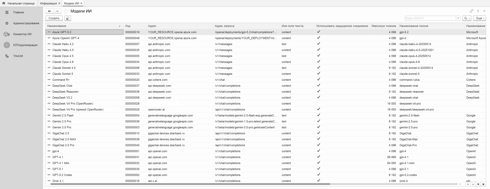
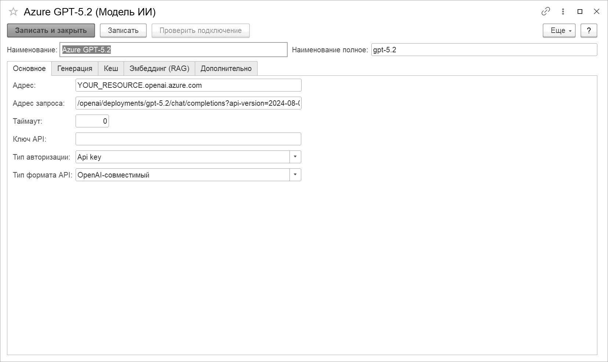
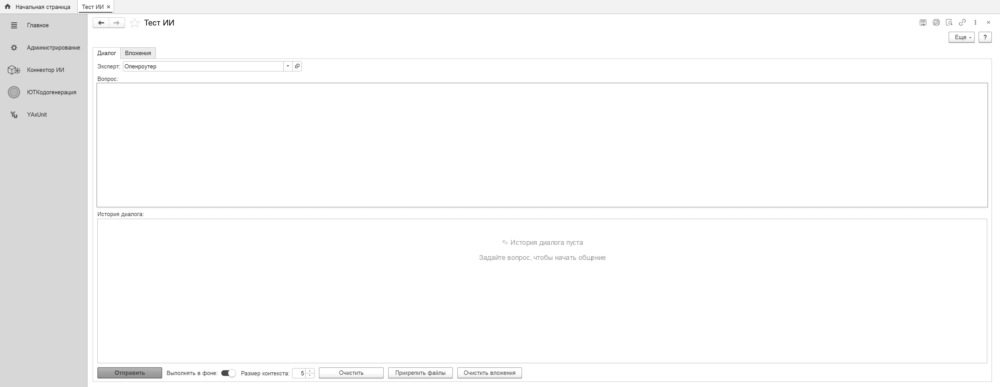

# Настройка моделей

Все обращения к языковым моделям в ИИконе идут через единый **коннектор** (`КИИ_КоннекторИИ`).
Модель — это элемент справочника **«Модели ИИ»**: адрес провайдера, формат API, способ
авторизации и параметры генерации. Настроил один раз — пользуются все подсистемы (чат,
аудитор кода, генератор диаграмм, RAG).

## Как это устроено

```
Подсистема ─▶ КИИ_КоннекторИИ ─▶ провайдер-адаптер ─▶ HTTP ─▶ API модели
             (прокси, таймаут,     (OpenAI / Anthropic /
              retry, auth)          Google / Yandex / GigaChat)
```

Коннектор сам подбирает адаптер под формат API модели, подставляет заголовки авторизации,
при необходимости идёт через прокси и повторяет запрос при обрыве авторизации. Подсистемам
не нужно знать, к какому провайдеру они обращаются — они просто зовут коннектор.

## Предустановленные модели

При первом запуске ИИкона предлагает заполнить справочник готовым набором из нескольких
десятков моделей популярных провайдеров: OpenAI, Anthropic, Google, Yandex, GigaChat,
DeepSeek, Mistral, Qwen, Groq, xAI, Cohere, Perplexity, OpenRouter, Azure OpenAI, Ollama.
Это шаблоны — адрес, формат API, тип авторизации и разумные параметры уже заполнены;
остаётся вписать свой ключ.

Заполнить набор можно из формы списка «Модели ИИ» (команда заполнения предустановленных
моделей). Повторный вызов не трогает уже существующие модели — только добавляет отсутствующие.



## Ключевые поля модели



| Поле | Что задаёт |
|---|---|
| **Наименование** | как модель называется в списках выбора (например, «Claude Opus 4.8») |
| **Наименование полное** | идентификатор модели в API провайдера (`claude-opus-4-8`, `gpt-4.1`, `deepseek-chat`) |
| **Адрес** / **Адрес запроса** | хост и путь эндпоинта; уходят в HTTP-запрос дословно |
| **Использовать защищённое соединение** | HTTPS (обычно да; выключить для локального Ollama) |
| **Тип формата API** | как формировать тело и разбирать ответ: `OpenAI_Compatible`, `Anthropic`, `Google`, `Yandex`, `GigaChat` |
| **Тип авторизации** | `Bearer`, `XApiKey`, `ApiKey`, `OAuth2ClientCredentials` |
| **Температура** | разброс ответа (0 — детерминированнее, 1 — креативнее) |
| **Максимум токенов** | верхний предел длины ответа |
| **Таймаут** | сколько ждать ответа, секунд (рассуждающим моделям ставьте больше) |
| **Использовать прокси** | идти через прокси из настроек, а не напрямую |
| **Поддерживает инструменты** | модель умеет function-calling (нужно генератору диаграмм и агент-анализу) |
| **Заголовки** | дополнительные HTTP-заголовки (табличная часть; `Content-Type`, версия API и т.п.) |

## Форматы API

ИИкона переводит внутренний запрос в формат конкретного провайдера. Достаточно выбрать
правильный **Тип формата API**:

- **OpenAI_Compatible** — самый распространённый: сам OpenAI и все, кто повторяет его схему
  `/v1/chat/completions` (DeepSeek, Mistral, Qwen, Groq, xAI, Cohere, Perplexity, OpenRouter,
  Azure, Ollama, GigaChat). Ответ читается из поля `content`.
- **Anthropic** — Claude (эндпоинт `/v1/messages`, заголовок `anthropic-version`).
- **Google** — Gemini (эндпоинт `generateContent`, ответ из `text`).
- **Yandex** — YandexGPT (эндпоинт `/foundationModels/v1/completion`, заголовок папки).

## Ключи API

Ключ модели **не хранится в справочнике открытым текстом** — он лежит в безопасном хранилище
1С. На форме элемента модели есть поле для ввода ключа: введённое значение уходит в
хранилище, а в поле остаётся заглушка. Поле рассчитано на длинные токены (IAM-токены Яндекса,
сервисные ключи) без ограничения длины.

## Авторизация по типам

| Тип | Как работает | Кто использует |
|---|---|---|
| **Bearer** | `Authorization: Bearer <ключ>` | OpenAI, DeepSeek, Mistral, Groq, xAI, OpenRouter, YandexGPT |
| **XApiKey** | заголовок `x-api-key: <ключ>` | Anthropic (Claude) |
| **ApiKey** | ключ в заголовке/параметре провайдера | Google, Azure |
| **OAuth2ClientCredentials** | коннектор сам получает и обновляет токен по client credentials | GigaChat |

Для GigaChat и Yandex, помимо ключа, нужны идентификаторы (папка/скоуп) — впишите их в
заголовки модели по образцу предустановленного шаблона.

## Прокси

Если 1С-сервер ходит в интернет через прокси, включите у модели флаг **«Использовать
прокси»** — коннектор направит запрос через прокси из настроек ИИконы. Адрес прокси задаётся
константой (полный адрес с портом; только порт без хоста недопустим). Модели без флага идут
напрямую — удобно, когда часть провайдеров доступна локально (Ollama), а часть через прокси.

## Модели для эмбеддингов (RAG)

Кроме чат-моделей, справочник хранит **модели-эмбеддеры** для семантического поиска. У них
`Тип модели = Эмбеддинг` и дополнительные поля (эндпоинт эмбеддингов, размерность вектора,
класс egress). Подробнее — в разделе **[RAG](../rag/README.md)**.

## Проверка модели

Что модель настроена верно, проще всего увидеть в обработке **«Тест ИИ»**: выбираете модель,
шлёте пробный запрос, смотрите ответ и параметры вызова. Все запросы и их стоимость
попадают в журнал запросов ИИ (регистр `КИИ_ЛогЗапросовИИ`) — там видно токены, время
ответа и модель.



## Условные обозначения

Плейсхолдеры в примерах — `<ключ>`, `<хост>`, `<адрес-прокси>` — подставьте свои значения.
