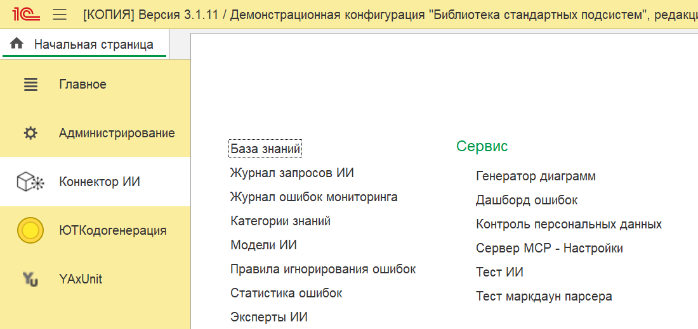
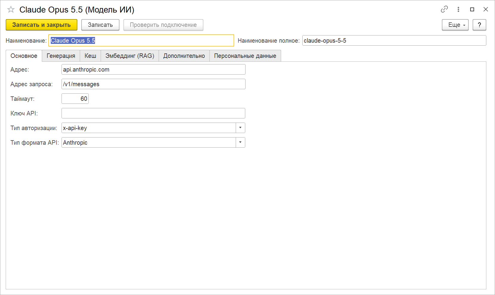
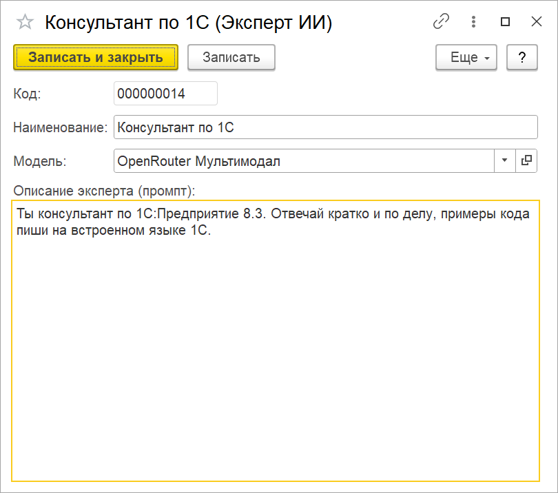
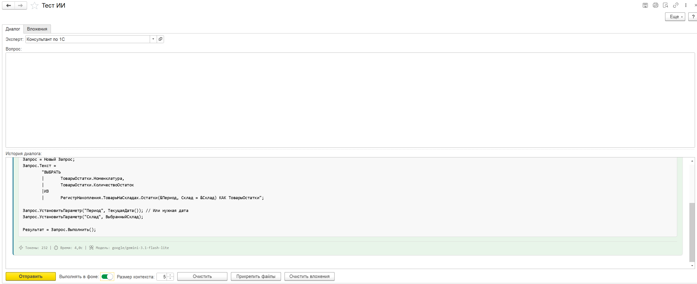

# Начало работы

От установки расширения до первого ответа модели — пять шагов. Нужен ключ API хотя бы одного
провайдера: OpenAI, Anthropic, Google, OpenRouter, GigaChat, YandexGPT или другого из
[списка](../настройка-моделей/README.md#предустановленные-модели). Для локальной модели через
Ollama или LM Studio ключ не нужен.

## Что нужно

- 1С:Предприятие 8.3.24 или новее; ИИкона разрабатывается и проверяется на 8.3.27.
- БСП 3.1.10 или новее.
- Режим совместимости интерфейса «Такси. Разрешить Версия 8.2» — так настроены типовые
  конфигурации, и платформа проверяет его при установке любого расширения.
- Доступ в интернет с сервера 1С до провайдера модели (или до своего сервера модели в контуре).

## 1. Установить расширение

1. Скачайте `IIkona_ConnectorAI_v<версия>.cfe` со страницы
   [релизов](https://github.com/andromanpro/1c-ai-connector/releases).
2. Добавьте его из файла: «Администрирование» → «Печатные формы, отчеты и обработки» →
   «Расширения» (или в конфигураторе: «Конфигурация» → «Расширения конфигурации»).
3. **Снимите у расширения флажок «Безопасный режим».** В безопасном режиме расширению запрещены
   HTTP-запросы, и ни одна модель не ответит.
4. Перезапустите сеанс — расширение подключится при следующем входе.

## 2. Выдать права

| Роль | Кому | Что дает |
|---|---|---|
| «КИИ полные права» | администратору ИИконы | настройка моделей, экспертов, контроля персональных данных, мониторинга, MCP-сервера |
| «КИИ базовые права» | пользователям, которые работают с ИИ через готовые функции | чтение моделей и экспертов, раздел «Коннектор ИИ», запись в журнал запросов |

В конфигурации на БСП роли добавляются в профиль группы доступа. Отдельные роли для веб-дашборда
ошибок и MCP-сервера описаны в [анализе ошибок](../анализ-ошибок/README.md) и
[MCP-сервере](../mcp-сервер/README.md).

После перезапуска в панели разделов появится «Коннектор ИИ»:

## 3. Заполнить модели и указать ключ

1. Откройте «Модели ИИ» и нажмите «Заполнить модели» — в справочник встанут 30 готовых моделей
   с адресом, форматом API и типом авторизации. Когда модели уже есть, та же кнопка называется
   «Обновить предустановленные модели» (подробнее — в [настройке моделей](../настройка-моделей/README.md)).
2. Откройте модель своего провайдера, на вкладке «Основное» введите «Ключ API» и нажмите
   «Записать». Ключ хранится в безопасном хранилище БСП, а не в реквизите модели:
   в списках и отчетах его не видно.
3. Нажмите «Проверить подключение». Кнопка доступна, когда модель записана и ключ введен.
   Проверка отправляет модели короткий запрос «Ответь одним словом: Тест» и показывает ответ и
   число израсходованных токенов, либо текст ошибки от провайдера.

Проверка берет ключ из записанной модели: если поменяли ключ, сначала запишите карточку.

## 4. Создать эксперта

Эксперт — это модель плюс системный промпт: кем модели быть и как отвечать. Через экспертов
работают «Тест ИИ» (в том числе ответы по базе знаний) и генератор диаграмм; мониторинг ошибок
берет модель из своей настройки.

«Эксперты ИИ» → «Создать»: наименование, модель и «Описание эксперта (промпт)».

Как писать промпт и подключить эксперту базу знаний — на странице [Эксперты ИИ](../эксперты/README.md).

## 5. Задать первый вопрос

Откройте «Тест ИИ», выберите эксперта, напишите вопрос и нажмите «Отправить». Ответ появится в
«Истории диалога» с оформлением Markdown (заголовки, списки, код), а под ним — число токенов,
время ответа и модель, которая ответила.

- **Выполнять в фоне** — запрос уходит фоновым заданием, форма не замирает на время ответа.
- **Размер контекста** — сколько прошлых сообщений диалога отправить вместе с новым вопросом;
  по умолчанию 5, `0` — вся история.
- **Прикрепить файлы** — картинки и документы для моделей, которые их принимают; вкладка
  «Вложения» показывает, что уйдет с вопросом.
- **Очистить** — начать диалог заново.

Каждый запрос попадает в «Журнал запросов ИИ»: токены, время, стоимость и признак ответа из кеша.

## Если модель не отвечает

| Что видно | Где искать |
|---|---|
| «Безопасный режим» или отказ в HTTP-соединении | флажок «Безопасный режим» у расширения (шаг 1) |
| 401 / «invalid api key» | ключ введен, но карточка не записана, или ключ от другого провайдера |
| 404 / «model not found» | «Наименование полное» — идентификатор модели у провайдера; у некоторых провайдеров модели выключаются |
| Таймаут | «Таймаут» на вкладке «Основное»; для рассуждающих моделей нужно больше 60 секунд |
| Нет доступа в интернет с сервера | прокси — в [настройке моделей](../настройка-моделей/README.md#прокси) |
| Запрос отклонен контролем персональных данных | [контроль персональных данных](../контроль-персональных-данных/README.md): режим канала и журнал контроля |

## Дальше

- [Эксперты ИИ](../эксперты/README.md) — промпт, категории знаний, эксперт для диаграмм.
- [Настройка моделей](../настройка-моделей/README.md) — поля карточки, форматы API, прокси, эмбеддеры.
- [Контроль персональных данных](../контроль-персональных-данных/README.md) — что уходит модели и чем заменяется.
- [RAG](../rag/README.md) — ответы по своей базе знаний.
- [Анализ ошибок](../анализ-ошибок/README.md) — разбор ошибок из журнала регистрации.
