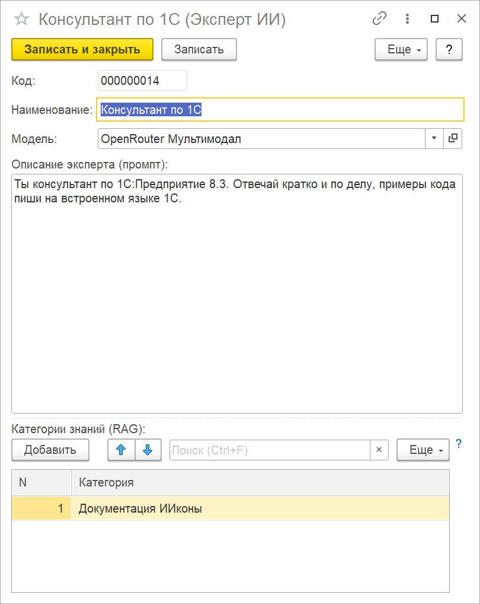

# Эксперты ИИ

Эксперт — это модель плюс системный промпт: кем модели быть и как отвечать. Один и тот же
ключ и одна модель могут стоять за несколькими экспертами: «Консультант по 1С», «Генератор
диаграмм», «Юрист по договорам» отличаются только промптом и базой знаний.

Справочник: «Коннектор ИИ» → «Эксперты ИИ».

## Поля карточки

| Поле | Что задает |
|---|---|
| Наименование | как эксперт называется в списках выбора |
| Модель | элемент «Модели ИИ», которому уйдет запрос: адрес, ключ, формат API |
| Описание эксперта (промпт) | системный промпт — роль, тон, формат ответа, ограничения |
| Категории знаний (RAG) | из каких категорий базы знаний эксперт берет справку; пусто — отвечает без базы знаний |

Таблица «Категории знаний (RAG)» появилась в карточке в 1.6.1. В более ранних версиях
табличная часть у эксперта была, но заполнить ее можно было только программно.

## Кто работает через эксперта

| Где | Что берет от эксперта |
|---|---|
| «Тест ИИ» | модель, промпт и категории знаний |
| Генератор диаграмм, режим «по описанию» | модель и промпт; база знаний не подмешивается |

Мониторинг ошибок и аудитор кода эксперта не используют: модель задается в их собственных
настройках (см. [анализ ошибок](../анализ-ошибок/README.md)).

Обе формы запоминают последнего выбранного эксперта и подставляют его при следующем открытии.

## Как писать промпт

Промпт уходит модели системным сообщением перед каждым вопросом. Что в нем работает:

- **Роль и аудитория.** «Ты консультант по 1С:Предприятие 8.3, отвечаешь программисту».
- **Формат ответа.** «Отвечай кратко, код — на встроенном языке 1С». «Тест ИИ» показывает
  Markdown, так что заголовки, списки и блоки кода выводятся оформленными.
- **Границы.** «Если в справке нет ответа, так и скажи» — полезно для эксперта с базой знаний.

Промпт проходит [контроль персональных данных](../контроль-персональных-данных/README.md)
вместе с вопросом: ФИО или ИНН, записанные прямо в промпт, уйдут модели подстановками.

## База знаний в ответах

Если у эксперта заполнены категории знаний, «Тест ИИ» перед отправкой вопроса:

1. Ищет в базе знаний этих категорий три фрагмента, ближайших к тексту вопроса по смыслу
   (как устроен поиск — на странице [RAG](../rag/README.md)).
2. Отбрасывает фрагменты, которые этой модели показывать нельзя: фрагменты с политикой
   «Только РФ» попадут только к модели с классом egress «Только РФ». Фрагменты с политикой
   «Запрещено внешнее» не индексируются и в поиск не попадают вовсе.
3. Добавляет найденное к промпту эксперта блоками `[СПРАВКА N НАЧАЛО]` … `[СПРАВКА N КОНЕЦ]`
   с оговоркой, что это справочный материал, а не инструкции. Промпт вместе со справкой
   ограничен 8000 символами: фрагменты, которые не влезли, отбрасываются. Если промпт
   эксперта сам занимает почти весь лимит, справка не добавляется вовсе — держите промпт
   коротким.

Ищется только текущий вопрос, без истории диалога. Если поиск не сработал — нет
эмбеддера, индекс пуст, эмбеддер вернул ошибку — эксперт отвечает без справки, а вопрос
все равно уходит модели.

Порядок настройки:

1. Модель-эмбеддер, категории и документы базы знаний, индексация — по шагам со страницы
   [RAG](../rag/README.md#настройка-по-шагам).
2. В карточке эксперта в таблице «Категории знаний (RAG)» нажмите «Добавить» и выберите
   категорию. Категорий может быть несколько. Запишите карточку.
3. Задайте вопрос этому эксперту в «Тесте ИИ».

## Эксперт для генератора диаграмм

Если в генераторе диаграмм эксперт не выбран, рядом с полем видна кнопка «Создать эксперта».
Она создает эксперта «Генератор диаграмм» с готовым промптом из макета обработки. Модель в
новом эксперте пустая: откройте его и выберите модель — запрос уходит модели эксперта. Подробнее — в
[диаграммах](../диаграммы/README.md).

## Если эксперт отвечает не так

| Что видно | Что проверить |
|---|---|
| «Не заполнен Эксперт ИИ» | в «Тесте ИИ» не выбран эксперт |
| Ответ не опирается на базу знаний | заполнена ли таблица «Категории знаний (RAG)»; проиндексированы ли документы и получены ли эмбеддинги; политика категории против класса egress модели |
| Модель отказывается принять картинку | формат API или сама модель не принимает файлы — см. [вложения](../вложения/README.md#какие-модели-принимают-файлы) |
| Ошибка модели (401, 404, таймаут) | карточку модели — см. [начало работы](../начало-работы/README.md#если-модель-не-отвечает) |
